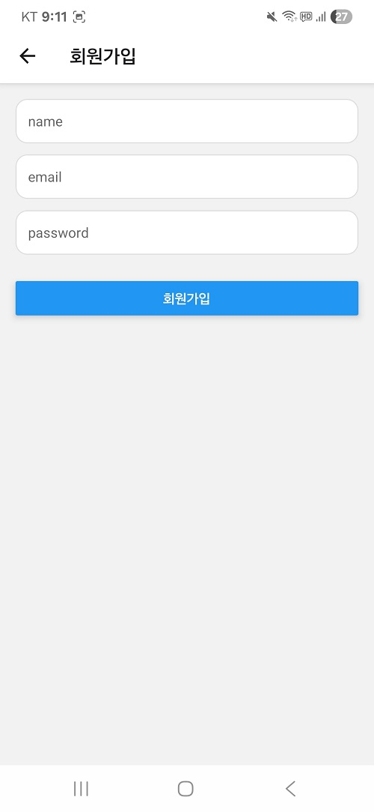
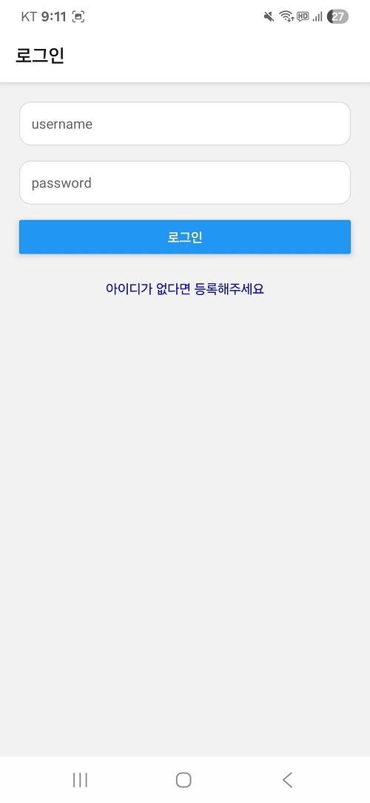

### 1. 프로젝트 팀원

#### 기간 : 25/08/25 - 25/08/31(1주)
#### 개발자 : 조홍래(APP DEVELOPER) 1인 총괄 
#### 깃허브 : https://github.com/louis2487
#### 이메일 : 36y4ws7@naver.com

### 2. 프로젝트 개요

#### 주제 : 일주일 안에 간단한 커뮤니티 앱 MVP 수준 구현
#### 기능 : 회원가입/로그인, 글(목록/상세/작성), 이미지 첨부, 댓글 작성 및 읽기
#### 개발 동기 : 케이엘피 리액트네이티브 앱 개발자 직무에 대한 실무 적합성 과제 테스트 

### 3. 사용 기술

#### UI + Activity : React Native Expo 
#### Client : Axio fetch 
#### Server : Fast API
#### DB : PostgreSQL
#### Hosting : Reilway
#### File Storage : Reilway Volume

### 4. 유저 흐름

#### 4.1 회원가입

#### 4.2 로그인

#### 4.3 목록

#### 4.4 상세

#### 4.5 작성

#### 4.6 로그아웃

### 5. API 요약

### **5.1 인증**
#### POST /community/signup : 회원가입
#### POST /community/login : 로그인

### **5.2 게시글**
#### GET /community/posts: 목록
#### GET/community/posts/${id} 상세
#### POST /community/posts : 작성

### **5.3 댓글**
#### POST /community/posts/${postId}/comments : 댓글 작성  
#### GET /community/posts/${postId}/comments : 댓글 읽기

### 6. GitHub Source Code

#### React Native App : https://github.com/louis2487/klp_mvp/tree/master/app
#### Backend : https://github.com/louis2487/myapi/blob/master/main.py

### 7. 시연 영상

#### (https://www.youtube.com/shorts/7X0e7kNGXls)